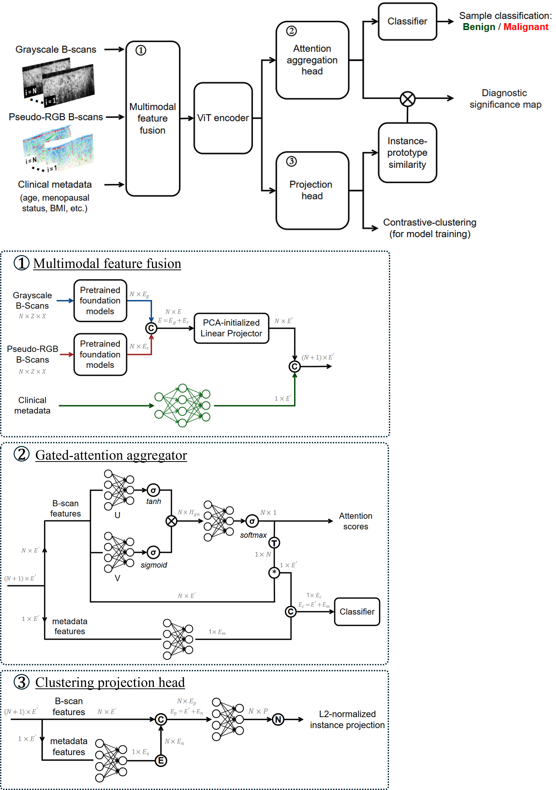
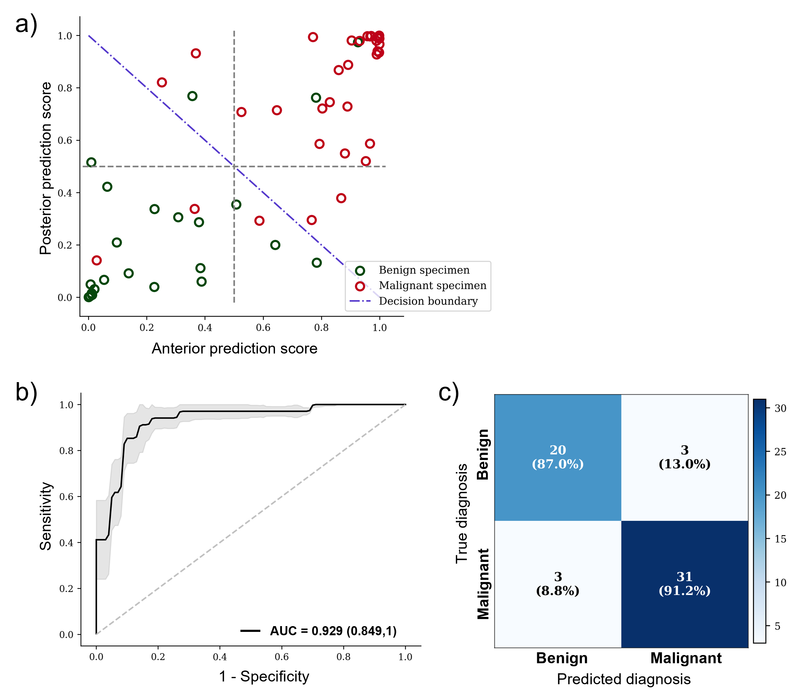
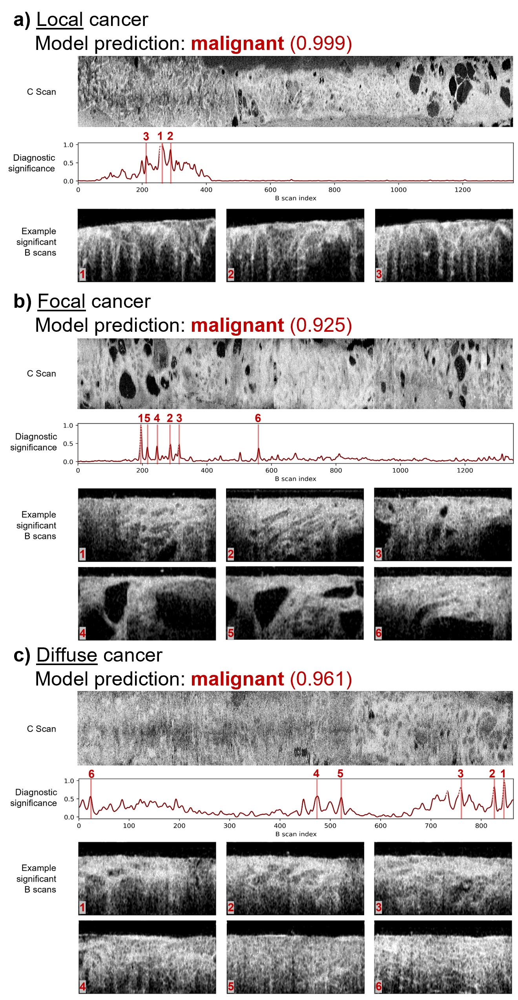

# OCT-MIViT: Multi-instance vision transformer for uterine endoscopic OCT

This repository contains the implementation of **OCT-MIViT** from the manuscript:
**"Multi-instance vision transformer with contrastive learning for endometrial cancer diagnosis from volumetric whole-cavity optical coherence tomography"**

## Manuscript abstract:
Early endometrial neoplasia can often be missed by macroscopic imaging or blind tissue sampling. Catheter-based optical coherence tomography (OCT) offers microscopic depth-resolved imaging of the entire endometrial cavity. And when paired with interpretable automated analysis, OCT can offer a promising method of non-invasive optical screening for endometrial cancer. We developed OCT-MIViT, a specimen-level multi-instance learning (MIL) vision transformer (ViT) that classifies volumetric OCT of endometrial cavity. The model fuses transfer-learned B-scan embeddings from pretrained foundation models, a lightweight ViT encoder with a clinical metadata context token, and gated-attention aggregator. An auxiliary contrastive-clustering objective was incorporated to emphasize small or localized malignant patterns. From an ex vivo cohort of 57 specimens, OCT-MIViT achieved high performance differentiating benign and malignant specimens with a specimen-level AUC of 0.929 (95% CI:0.850-1), 91.2% sensitivity and 87.0% specificity. The model also outputs interpretable, per-B-scan diagnostic significance traces by combining model attention scores with instance-prototype similarity scores, enabling identification of malignancy patterns and localization of lesion sites. Interpretable model outputs also facilitate error analysis that reveals the model’s failure modes that provide future directions for improving the current imaging configuration and dataset diversity. Overall, OCT-MIViT achieves a promising balance of accuracy, interpretability, and sensitivity to local pathology for automated analysis of whole-cavity OCT, supporting its potential as a noninvasive screening tool for endometrial cancer.

---

## Repository structure
- **`data/`** – Dataset utilities and preprocessing  
- **`embed/`** – Embedding generation and PCA initialization  
- **`models/`** – Model architectures (OCT-MIL-ViT and variants)  
- **`train/`** – Training, evaluation, and testing scripts  
- **`loss/`** – Custom loss functions
- **`artifacts/`** - Temp data
- **`docs/images/`** – Figures for model illustration and results

## Model architecture
The proposed model is based on a **Vision Transformer (ViT)** backbone with a **multi-instance learning (MIL) pooling mechanism** that aggregates information across B-scans within each volumetric OCT scan. The model incorporates a auxiliary contrastive-clustering loss to facilitate learning of focal lesions. Clinical metadata (e.g., age, menopausal status) can be integrated as conditioning tokens.

<p align="center">
  
</p>

## Model performance
The model achieves strong performance in distinguishing **benign vs. malignant endometrial lesions** on held-out test sets.  

<p align="center">
  
</p>

## Model interpretation
Attention-based instance-level visualization highlights **suspicious cancer regions** within OCT volumes, aiding interpretability and potential clinical deployment.

<p align="center">
  
</p>

- Regions with higher attention scores correspond to **cancer-suspicious areas**, while normal regions show consistent low attention.  
- This provides clinicians with an intuitive way to verify model decisions.  

## Getting started
```bash
git clone https://github.com/YXLin1159/OCT-MIViT-endometrial-cancer.git
cd OCT-MIViT-endometrial-cancer
conda env create -f environment.yml
conda activate oct-mivit